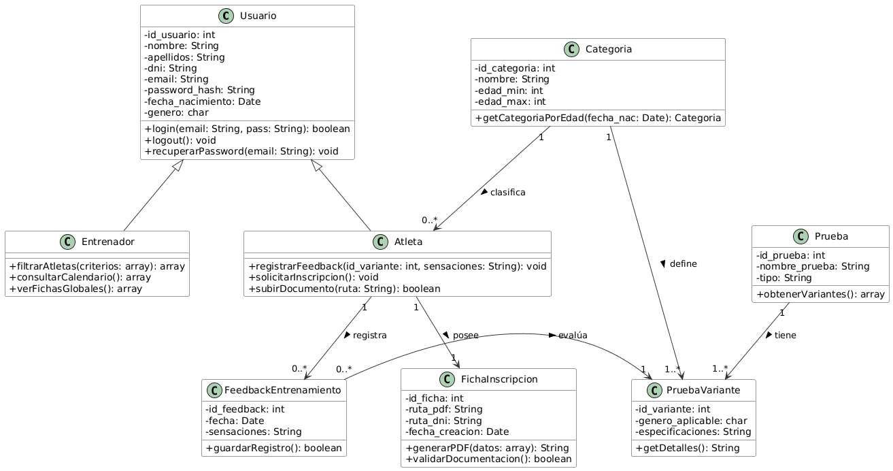
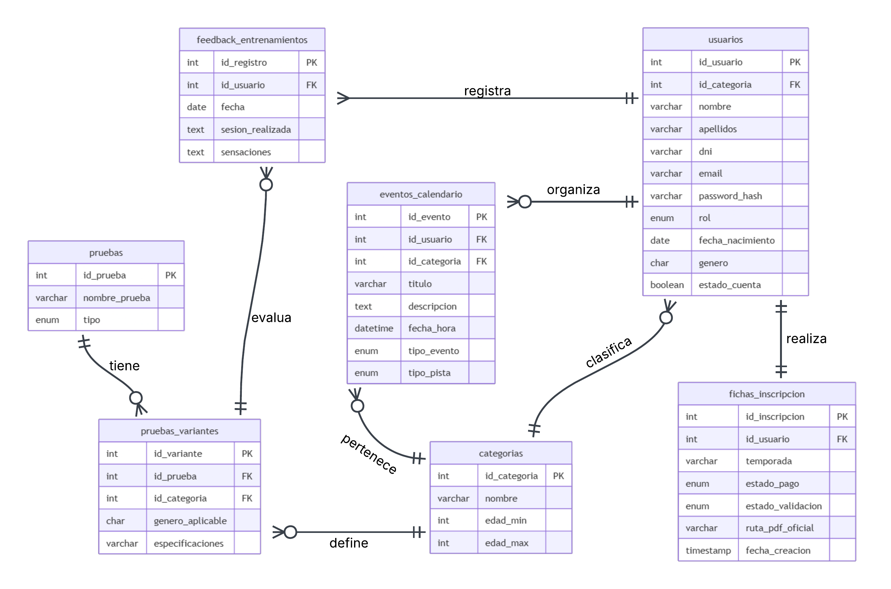
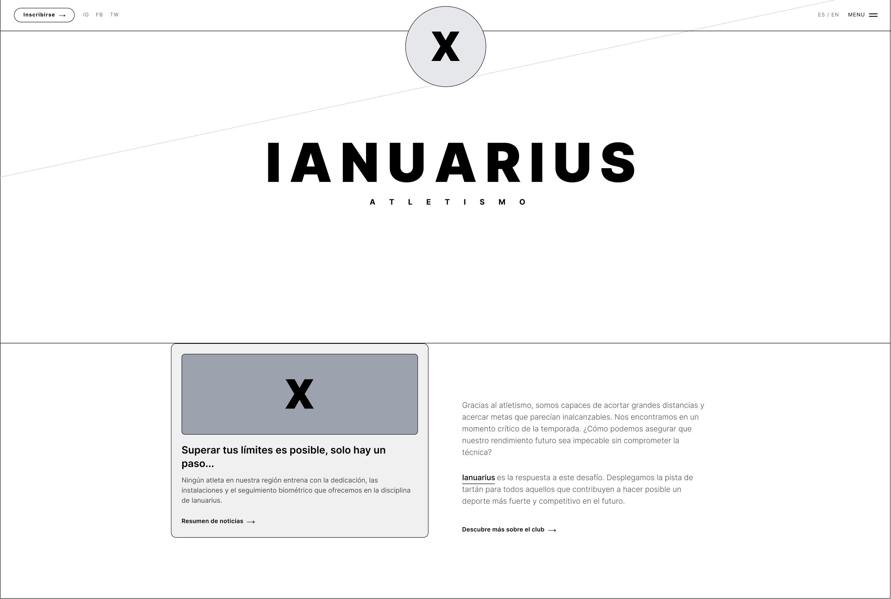
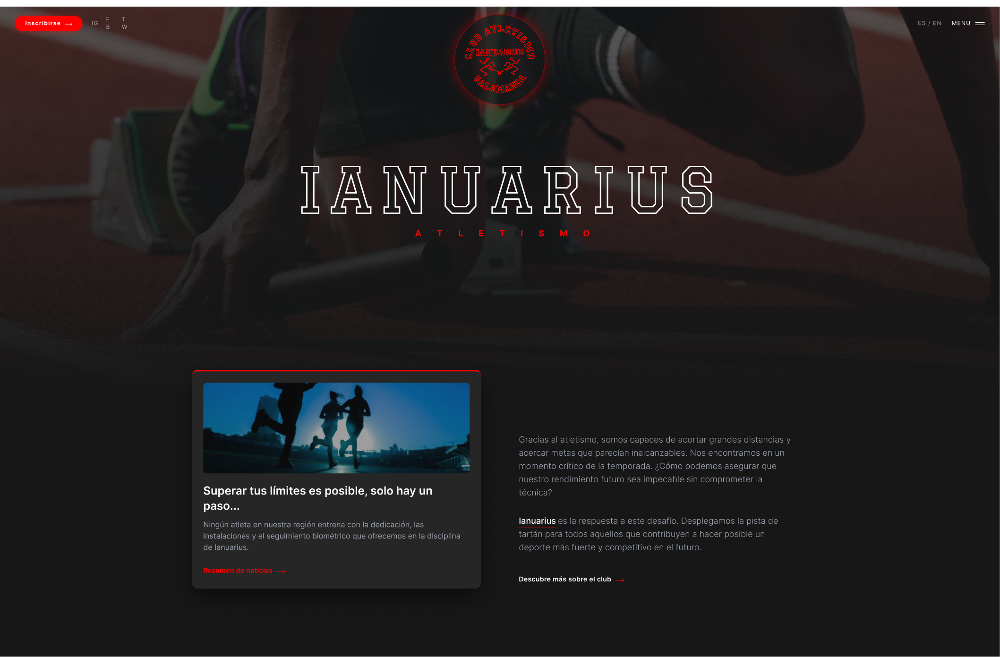
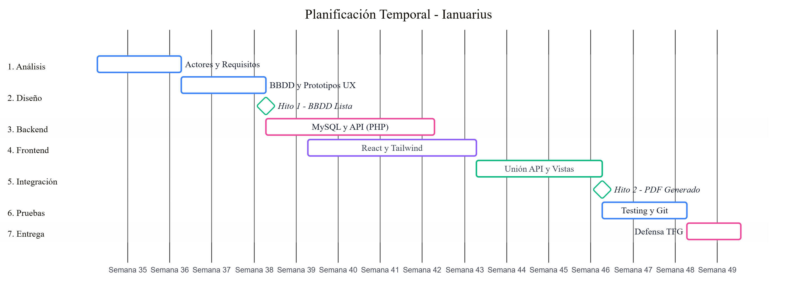

# MEMORIA DEL PROYECTO - IANUARIUS

  
   
  <em>Figura 1. Logotipo "Atletismo Salamanca Ianuarius"</em>

  

- **Autor:** Iván Martín Nieto
- **Tutor:** Serafina Martín Marcos
- **Ciclo:** Desarrollo de Aplicaciones Web (I.E.S. Venancio Blanco)

    

	<a href="https://ivee31.github.io/TFG-DAW2/" target="_blank">🌐 Ver Documentación Online</a> 
	(pinchar con 'ctrl' para abrir en otra pestaña)

---
  

## Licencia
Esta obra está bajo una licencia Reconocimiento-Compartir bajo la misma licencia 3.0 España de Creative Commons. Para ver una copia de la licencia, visite [Creative Commons](http://creativecommons.org/licenses/by-sa/3.0/es/) o envíe una carta a Creative Commons, 171 Second Street, Suite 300, San Francisco, California 94105, USA.

---
  

## Índice de Contenido

- [Índice de Figuras](#índice-de-figuras)
- [Índice de Tablas](#índice-de-tablas)

1. [Introducción y Justificación](#1-introducción-y-justificación)
2. [Definición del Sistema](#2-definición-del-sistema)
3. [Diseño Tecnológico y Arquitectura](#3-diseño-tecnológico-y-arquitectura)
4. [Planificación y Metodología](#4-planificación-y-metodología)
5. [Desarrollo e Implementación](#5-desarrollo-e-implementación)
6. [Pruebas y Control de Calidad](#6-pruebas-y-control-de-calidad)
7. [Conclusiones y Futuro](#7-conclusiones-y-futuro)
8. [Referencias y bibliografía](#8-referencias-y-bibliografía)
9. [Glosario de Términos y Acrónimos](#9-glosario-de-términos-y-acrónimos)
10. [Anexos](#10-anexos)

---
  

## Índice de Figuras
- [Figura 1. Logo Ianuarius](#figura1-logo)
- [Figura 3. Interfaz de competiciones de Clupik](#figura3-clupik)
- [Figura 4. Interfaz de gestión de Playoff Informática](#figura4-playoff1)
- [Figura 5. Funcionalidades de Playoff Informática](#figura5-playoff2)
- [Figura 6. Diagrama de Casos de Uso del Sistema](#figura6-uml)
- [Figura 7. Diagrama UML](#figura7-clases)
- [Figura 8. Diagrama Entidad-Relación de la DB](#figura8-er)
- [Figura 9. Modelo Relacional de la DB](#figura9-relacional)
- [Figura 10. Wireframe estructural de la página "Home"](#figura10-wireframe)
- [Figura 11. Mockup final aplicando la paleta de colores](#figura11-mockup)
- [Figura 12. Diagrama de Gantt con la previsión del proyecto](#figura12-gantt)

  

## Índice de Tablas
- [Tabla 1. Costes de Hardware y Software](#tabla-hardware)
- [Tabla 2. Costes de Personal (Desarrollo)](#tabla-personal)
- [Tabla 3. Costes de Mantenimiento Anual](#tabla-mantenimiento)
- [Tabla 4. Análisis SMART: Objetivo General](#tabla-smart-gen)
- [Tabla 5. Análisis SMART: Objetivos Funcionales](#tabla-smart-func)
- [Tabla 6. Definición de Actores](#tabla-actores)
- [Tabla 7. Especificación de Casos de Uso](#tabla-cu)
- [Tabla 8. Requisitos Funcionales y No Funcionales](#tabla-rf)
- [Tabla 9. Requisitos de Información (IRQ)](#tabla-irq)
- [Tabla 10. Stack Tecnológico](#tabla-stack)
- [Tabla 11. Diccionario de datos: categorias](#tabla-categorias)
- [Tabla 12. Diccionario de datos: pruebas](#tabla-pruebas)
- [Tabla 13. Diccionario de datos: pruebas_variantes](#tabla-variantes)
- [Tabla 14. Diccionario de datos: usuarios](#tabla-usuarios)
- [Tabla 15. Diccionario de datos: fichas_inscripcion](#tabla-fichas)
- [Tabla 16. Diccionario de datos: feedback_entrenamientos](#tabla-feedback)
- [Tabla 17. Fases de Planificación (Gantt)](#tabla-gantt)
- [Tabla 18. Glosario de Términos](#tabla-glosario)

---
   

# 1. Introducción y Justificación

  

## 1.1. Memoria Inicial
Aplicación web centrada en la gestión del club de atletismo Ianuarius, de forma que se digitalice su gestión.
En cualquiera de los casos, cabe destacar que el proyecto ha sido ampliamente pensado para el club homónimo al título de este, por lo que, para otros clubes, cabría la posibilidad de que haya funciones insuficientes o que, por el contrario, haya un exceso de estas.

  

## 1.2. Justificación
Por otra parte, gracias a esta transición al mundo digital, permitirá añadir funcionalidades que, en un entorno físico, sin esta aplicación, serían muy costosos, complicados o incluso imposibles de llevar a cabo, sobre todo teniendo en cuenta el gran número de atletas pertenecientes al club, de los cuales, su gran mayoría son menores, o lo suficientemente pequeños como para no estar capacitados para manejarse por sí mismos.

  

## 1.3. Oportunidad de Negocio
Este proyecto nace de la observación directa de una carencia tecnológica en el ámbito deportivo local. Los clubes de atletismo modestos no disponen de presupuestos holgados para contratar plataformas de gestión genéricas de alto coste. 

Ianuarius se presenta como un software vertical, específico para atletismo, de bajo coste y centrado en resolver el "cuello de botella" burocrático de las inscripciones de menores de edad.

  

## 1.4. Estudio del Sector
Tras analizar soluciones existentes en el mercado actual:

 

**1.4.1. Clupik**
Centrada en la gestión de competiciones, pero carece de herramientas para la burocracia de un club de atletismo.

*Figura 3. Interfaz de competiciones de Clupik*

 

**1.4.2. Playoff Informática**
Herramienta sobredimensionada ("overkill"); ofrece cientos de funcionalidades que un club modesto jamás usará, encareciendo el servicio.

*Figura 4. Interfaz de gestión de Playoff Informática*

 

*Figura 5. Funcionalidades de Playoff Informática*

  

## 1.5. Análisis de Viabilidad
El proyecto es viable técnicamente utilizando React, PHP y MySQL garantizando el estricto cumplimiento del RGPD.

 

**Costes de Hardware y Software**

| Concepto | Descripción | Coste Estimado |
| :--- | :--- | :--- |
| **Hardware** | Amortización de equipo informático. | 250,00 € |
| **Software IDE** | Visual Studio Code, Obsidian. | 0,00 € (Free) |
| **Entorno Servidor** | XAMPP (Apache, MySQL, PHP). | 0,00 € (Free) |
| **Diseño / UI** | Figma (Plan gratuito), Tailwind CSS. | 0,00 € (Free) |

 

**Costes de Personal (Desarrollo)**

| Fase | Horas Estimadas | Coste (18 € / h) |
| :--- | :--- | :--- |
| Análisis y Diseño | 40 h | 720,00 € |
| Desarrollo Backend y BBDD | 50 h | 900,00 € |
| Desarrollo Frontend y Vistas | 40 h | 720,00 € |
| Pruebas y Documentación | 20 h | 360,00 € |
| **Total** | **150 h** | **2.700,00 €** |

 

**Costes de Mantenimiento Anual**

| Concepto | Descripción | Coste Anual |
| :--- | :--- | :--- |
| **Dominio** | Registro y renovación (ej. ianuarius.es). | 12,00 € / año |
| **Hosting EEE** | Servidor compartido / VPS en Europa. | 75,00 € / año |
| **SSL** | Let's Encrypt (HTTPS). | 0,00 € |

---
   

# 2. Definición del Sistema

  

## 2.1. Objetivos del Proyecto

 

**Análisis SMART: Objetivo General**

| Concepto | Descripción | Análisis SMART |
| :--- | :--- | :--- |
| **General** | Desarrollar una plataforma web integral para digitalizar Ianuarius. | **S:** 100% inscripciones digitales. **M:** Reducir tiempo a < 3 min. **A:** React + PHP. **R:** Elimina papel físico. **T:** Temporada 26/27. |

 

**Análisis SMART: Objetivos Funcionales**

| ID | Módulo | Descripción | Prio. |
| :--- | :--- | :--- | :--- |
| **OBJ-01** | Usuarios | Registro, Login y roles (Admin, Entrenador, Atleta). | Alta |
| **OBJ-02** | Fichas | Subida de archivos escaneados (legacy). | Alta |
| **OBJ-03** | Fichas | Inscripción online y generación automática PDF. | Media |
| **OBJ-04** | Gestión | Filtros avanzados (Categoría, edad, marcas). | Media |
| **OBJ-05** | Atletas | Feedback de entrenamientos (sensaciones). | Baja |

  

## 2.2. Definición de Actores

 

**Definición de Actores**

| Rol | Descripción y Permisos |
| :--- | :--- |
| **Visitante** | Accede a portfolio público. Puede registrarse y recuperar contraseña. |
| **Atleta** | Iniciar sesión, realizar inscripciones, acceder a historial, cerrar sesión y registrar feedback de entrenamientos. |
| **Entrenador** | Permisos de Atleta + visualizar todas las fichas, aplicar filtros avanzados y consultar calendario global. |
| **Sistema (PDF/Correo)** | Actor automático. Recibe datos para compilar el documento oficial y realiza el envío de notificaciones. |

  

## 2.3. Especificación Funcional

 

  
   <em>Figura 6. Diagrama de Casos de Uso del Sistema</em>

 

**Especificación de Casos de Uso (Principales)**

| ID | Caso de Uso | Actor | Descripción Básica |
| :--- | :--- | :--- | :--- |
| **UC-01** | Registro y Autenticación (Login/Logout) | Visitante / Atleta / Entrenador | Registro y acceso/cierre de sesión seguro destruyendo tokens. |
| **UC-02** | Recuperar Contraseña | Visitante | Solicitud de link de recuperación por correo electrónico. |
| **UC-03** | Realizar Inscripción Online | Atleta / Sistema | Completar formulario médico, generación de PDF y envío. |
| **UC-04** | Subir Archivo Físico / DNI | Atleta | Adjuntar DNI o fichas escaneadas con validación de peso/formato. |
| **UC-05** | Registrar Feedback de Entrenamientos | Atleta | Anotar sensaciones y estado físico tras una sesión deportiva. |
| **UC-06** | Filtrar Fichas Globales | Entrenador | Búsqueda y listado mediante consulta SQL dinámica (edad, prueba). |

  

## 2.4. Requisitos del Sistema (SRS)

 

**Requisitos Funcionales**

| ID | Descripción Detallada | Actor | Prio. |
| :--- | :--- | :--- | :--- |
| **RF-01** | Registro de nuevos usuarios en el sistema. | Visitante | Alta |
| **RF-02** | Autenticación y Control de Acceso (Login). | Todos | Alta |
| **RF-03** | Recuperación de credenciales (Password Reset). | Visitante | Alta |
| **RF-04** | Cierre de sesión seguro (Logout) para destrucción de tokens. | Atleta/Entren. | Alta |
| **RF-05** | Gestión de Inscripciones Online a nueva temporada. | Atleta | Alta |
| **RF-06** | Edición controlada de datos de inscripción. | Atleta | Media |
| **RF-07** | Carga y almacenamiento de documentación digital (DNI). | Atleta | Alta |
| **RF-08** | Registro de Feedback de entrenamientos. | Atleta | Media |
| **RF-09** | Generación automatizada de comprobantes en PDF. | Sistema | Alta |
| **RF-10** | Envío automatizado de notificaciones por Email. | Sistema | Media |
| **RF-11** | Consulta personal del historial de marcas y entrenamientos. | Atleta | Baja |
| **RF-12** | Filtrado y búsqueda global de fichas por edad o categoría. | Entrenador | Media |
| **RF-13** | Visualización de calendario y planificación grupal. | Entrenador | Baja |

 

**Requisitos No Funcionales**

| ID | Categoría | Descripción y Métrica Verificable |
| :--- | :--- | :--- |
| **RNF-01** | Seguridad | Las contraseñas se cifrarán utilizando el algoritmo de hashing Bcrypt. |
| **RNF-02** | Seguridad | Las sesiones se invalidarán tras 30 minutos de inactividad. |
| **RNF-03** | Rendimiento | Generación y envío del PDF oficial en menos de 5 segundos. |
| **RNF-04** | Rendimiento | Las consultas de filtrado global se resolverán en menos de 2 segundos. |
| **RNF-05** | Usabilidad | Diseño Mobile First para uso táctil a pie de pista. |
| **RNF-06** | Usabilidad | Cumplimiento del estándar de accesibilidad web WCAG 2.1 (Nivel AA). |
| **RNF-07** | Disponibilidad | Uptime (tiempo en línea) garantizado del 99.9% anual mediante hosting. |

 

**Requisitos de Información (IRQ)**

| ID: IRQ-01 | Info. de Usuarios y Fichas |
| :--- | :--- |
| **Datos Clave** | • Credenciales: Email (Unique), Password (Hash). • Perfil: DNI (Unique), Fecha Nacimiento. • Fichas: Rutas absolutas a los archivos físicos. |

  

## 2.5. Normativa y Legislación
El sistema cumple estrictamente con el **RGPD y LOPDGDD** (alojamiento en Europa, derecho al olvido, minimización de datos), la **LSSI-CE** (Aviso Legal público y uso de cookies técnicas exentas de consentimiento), pautas de accesibilidad **WCAG 2.1 AA** (contraste, navegación semántica) y utiliza tecnologías y librerías bajo licencias aptas para uso privativo (MIT, GPL).

---
   

# 3. Diseño Tecnológico y Arquitectura

 

**Stack Tecnológico**

| Capa | Tecnología | Descripción |
| :--- | :--- | :--- |
| **Frontend** | React 18 + Tailwind | Interfaz dinámica Single Page Application (SPA). |
| **Backend** | PHP 8.2 | Lógica de negocio, API REST y protección directorios. |
| **BBDD** | MySQL 8.0 | Persistencia de datos e integridad relacional. |

  

## 3.2. Arquitectura
Modelo Cliente-Servidor. El Frontend (React) captura acciones y realiza peticiones asíncronas (fetch) a la API REST (PHP).

  

## 3.3. Diagrama de Clases (UML)

  
   <em>Figura 7. Diagrama UML</em>

  

## 3.4. Diseño de Datos

Para gestionar las especialidades del atletismo se ha implementado una tabla intermedia de variantes.

 

  
   <em>Figura 8. Diagrama de Entidad-Relación de la DB</em>

 

  
   <em>Figura 9. Modelo Relacional de la DB</em>

 

**Diccionario: categorias**

| Campo | Tipo | Restricciones | Descripción |
| :--- | :--- | :--- | :--- |
| **id_categoria** | INT | PK, AI | Identificador único. |
| **nombre** | VARCHAR(50) | NOT NULL | Nombre (ej. 'Sub-16'). |
| **edad_min / max**| INT | NOT NULL | Rango de edad. |

 

**Diccionario: pruebas**

| Campo | Tipo | Restricciones | Descripción |
| :--- | :--- | :--- | :--- |
| **id_prueba** | INT | PK, AI | Identificador único. |
| **nombre_prueba** | VARCHAR(50) | NOT NULL | Ej: '100m'. |
| **tipo** | ENUM | NOT NULL | 'Carrera', 'Salto', 'Lanz'. |

 

**Diccionario: pruebas_variantes**

| Campo | Tipo | Restricciones | Descripción |
| :--- | :--- | :--- | :--- |
| **id_variante** | INT | PK, AI | Identificador único. |
| **id_prueba** | INT | FK | Prueba base. |
| **id_categoria** | INT | FK | Categoría a la que aplica. |
| **especificaciones**| VARCHAR(100)| NULL | Ej: '0.84m', '4kg'. |

 

**Diccionario: usuarios**

| Campo | Tipo | Restricciones | Descripción |
| :--- | :--- | :--- | :--- |
| **id_usuario** | INT | PK, AI | Identificador. |
| **nombre / apel.** | VARCHAR | NOT NULL | Datos personales. |
| **dni / email** | VARCHAR | UNIQUE | Identificación. |
| **rol** | ENUM | DEFAULT 'atleta'| 'Admin' o 'Atleta'. |
| **fecha_nac / gen.**| DATE / ENUM | NOT NULL | Cálculo categorías. |

 

**Diccionario: fichas_inscripcion**

| Campo | Tipo | Restricciones | Descripción |
| :--- | :--- | :--- | :--- |
| **id_ficha** | INT | PK, AI | Identificador. |
| **id_usuario** | INT | FK, UNIQUE | Propietario (1:1). |
| **ruta_pdf / dni** | VARCHAR(255)| NULL | Rutas de archivos. |

 

**Diccionario: feedback_entrenamientos**

| Campo | Tipo | Restricciones | Descripción |
| :--- | :--- | :--- | :--- |
| **id_feedback** | INT | PK, AI | Identificador. |
| **id_usuario** | INT | FK | Atleta. |
| **id_variante** | INT | FK | Prueba entrenada. |
| **sensaciones** | TEXT | NULL | Comentarios. |

  

## 3.5. Diseño de Interfaz (UI/UX)
Diseño **Mobile First** usando Tailwind CSS. Paleta corporativa (Rojo Ianuarius) y tipografía **Inter** (junto con la fuente deportiva *Graduate*). Prototipado previo en **Figma** para validar flujos de navegación.

  
   <em>Figura 10. Wireframe estructural de la página "Home"</em>

  
   <em>Figura 11. Mockup final aplicando la paleta de colores y tipografía definida</em>

---
   

# 4. Planificación y Metodología

  

## 4.1. Metodología de Trabajo
Se ha optado por una **Metodología Ágil basada en un modelo Scrum adaptado**. Se utilizará un tablero Kanban (GitHub Projects) y un flujo de trabajo basado en **Feature Branches (Ramas)** en Git, requiriendo *Pull Requests* para la revisión de código antes de la integración a la rama principal.

  

## 4.2. Planificación Temporal (Gantt)

 

  
   <em>Figura 12. Diagrama de Gantt con la previsión del proyecto e hitos clave.</em>

 

**Fases de Planificación (Gantt)**

| Fase | Tarea Principal | Semanas |
| :--- | :--- | :--- |
| **1. Análisis** | Definición de actores, Casos de Uso y Requisitos. | 1 – 2 |
| **2. Diseño** | Diseño de BBDD y prototipos. *(Hito: BBDD Diseñada)* | 3 – 4 |
| **3. Backend** | Desarrollo MySQL, PHP 8.2, API REST. | 5 – 8 |
| **4. Frontend** | Maquetación responsiva con React y Tailwind. | 6 – 9 |
| **5. Integración** | Unificación API y Vistas. *(Hito: 1º PDF Generado)* | 10 – 12 |
| **6. Pruebas** | Tests de validación, resolución bugs y revisión Git. | 13 – 14 |
| **7. Entrega** | Redacción de memoria final y defensa. | 15 |

---
   

# 5. Desarrollo e Implementación
*(Contenido pendiente de próximos entregables)*

   

# 6. Pruebas y Control de Calidad
*(Contenido pendiente de próximos entregables)*

   

# 7. Conclusiones y Futuro
*(Contenido pendiente de próximos entregables)*

   

# 8. Referencias y bibliografía
* **Mermaid Live Editor:** Herramienta para diagramas UML. Disponible en: [https://mermaid.live/](https://mermaid.live/)

   

# 9. Glosario de Términos y Acrónimos

 

**Glosario de Términos**

| Término | Definición |
| :--- | :--- |
| **API** | Interfaz que permite que dos aplicaciones se comuniquen entre sí. |
| **Backend** | Parte de la aplicación que se ejecuta en el servidor. |
| **CRUD** | Acrónimo de las funciones básicas (Create, Read, Update, Delete). |

   

# 10. Anexos
*(Contenido pendiente de próximos entregables)*
