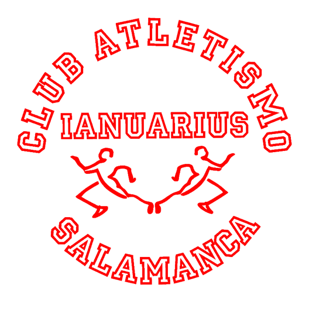
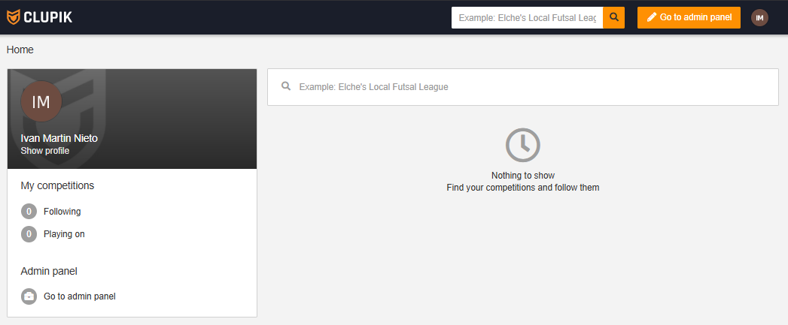
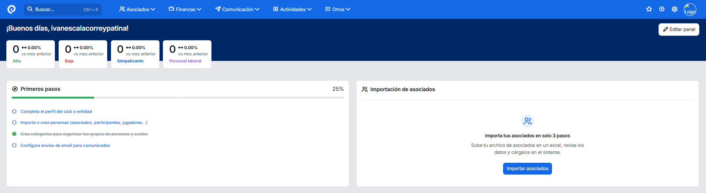
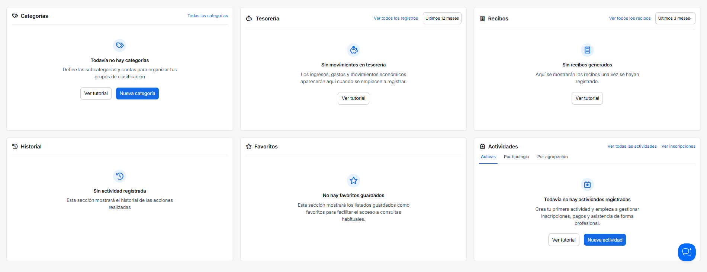
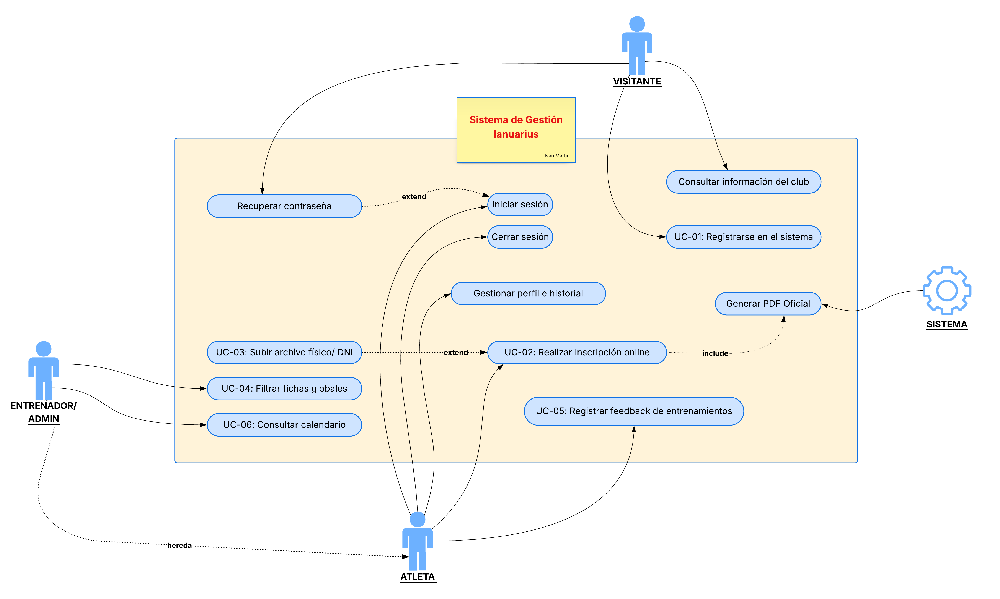
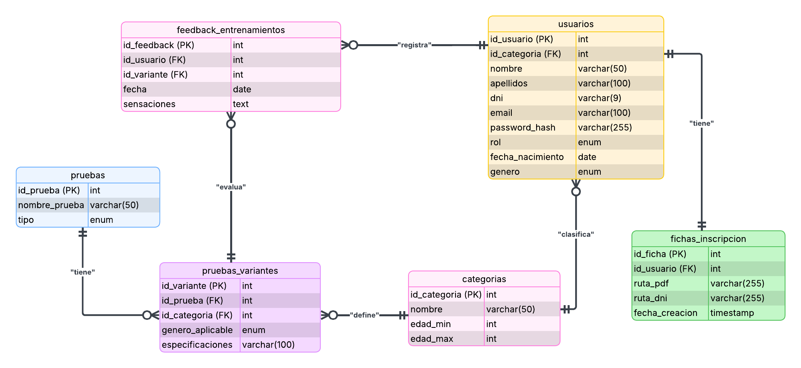

# MEMORIA DEL PROYECTO - IANUARIUS

  
   
  <em>Figura 1. Logotipo "Atletismo Salamanca Ianuarius"</em>

  

- **Autor:** Iván Martín Nieto
- **Tutor:** Serafina Martín Marcos
- **Ciclo:** Desarrollo de Aplicaciones Web (I.E.S. Venancio Blanco)

  

	<a href="https://ivee31.github.io/TFG-DAW2/" target="_blank">🌐 Ver Documentación Online</a>
	
(pinchar con 'ctrl' para abrir en otra pestaña)

---

## Licencia
Esta obra está bajo una licencia Reconocimiento-Compartir bajo la misma licencia 3.0 España de Creative Commons. Para ver una copia de la licencia, visite [Creative Commons](http://creativecommons.org/licenses/by-sa/3.0/es/) o envíe una carta a Creative Commons, 171 Second Street, Suite 300, San Francisco, California 94105, USA.

---

## Índice de Contenido

- [Índice de Figuras](#índice-de-figuras)
- [Índice de Tablas](#índice-de-tablas)

1. [Introducción y Justificación](#1-introducción-y-justificación)
2. [Definición del Sistema](#2-definición-del-sistema)
3. [Diseño Tecnológico y Arquitectura](#3-diseño-tecnológico-y-arquitectura)
4. [Planificación y Metodología](#4-planificación-y-metodología)
5. [Desarrollo e Implementación](#5-desarrollo-e-implementación)
6. [Pruebas y Control de Calidad](#6-pruebas-y-control-de-calidad)
7. [Conclusiones y Futuro](#7-conclusiones-y-futuro)
8. [Referencias y bibliografía](#8-referencias-y-bibliografía)
9. [Glosario de Términos y Acrónimos](#9-glosario-de-términos-y-acrónimos)
10. [Anexos](#10-anexos)

---

## Índice de Figuras
- [Figura 1. Logo Ianuarius](#figura1-logo)
- [Figura 2. Logo Venancio Blanco](#figura2-venancio)
- [Figura 3. Interfaz de competiciones de Clupik](#figura3-clupik)
- [Figura 4. Interfaz de gestión de Playoff Informática](#figura4-playoff1)
- [Figura 5. Funcionalidades de Playoff Informática](#figura5-playoff2)
- [Figura 6. Diagrama de Casos de Uso del Sistema](#figura6-uml)
- [Figura 7. Diagrama Entidad-Relación de la DB](#figura7-db)
- [Figura 8. Diagrama de Gantt con la previsión del proyecto](#figura8-gantt)

## Índice de Tablas
- [Tabla 1. Costes de Hardware y Software](#tabla-hardware)
- [Tabla 2. Costes de Personal (Desarrollo)](#tabla-personal)
- [Tabla 3. Costes de Mantenimiento Anual](#tabla-mantenimiento)
- [Tabla 4. Análisis SMART: Objetivo General](#tabla-smart-gen)
- [Tabla 5. Análisis SMART: Objetivos Funcionales](#tabla-smart-func)
- [Tabla 6. Definición de Actores](#tabla-actores)
- [Tabla 7. Especificación de Casos de Uso](#tabla-cu)
- [Tabla 8. Requisitos Funcionales y No Funcionales](#tabla-rf)
- [Tabla 9. Requisitos de Información (IRQ)](#tabla-irq)
- [Tabla 10. Stack Tecnológico](#tabla-stack)
- [Tabla 11. Diccionario de datos: categorias](#tabla-categorias)
- [Tabla 12. Diccionario de datos: pruebas](#tabla-pruebas)
- [Tabla 13. Diccionario de datos: pruebas_variantes](#tabla-variantes)
- [Tabla 14. Diccionario de datos: usuarios](#tabla-usuarios)
- [Tabla 15. Diccionario de datos: fichas_inscripcion](#tabla-fichas)
- [Tabla 16. Diccionario de datos: feedback_entrenamientos](#tabla-feedback)
- [Tabla 17. Fases de Planificación (Gantt)](#tabla-gantt)
- [Tabla 18. Glosario de Términos](#tabla-glosario)

---

# 1. Introducción y Justificación

## 1.1. Memoria Inicial
Aplicación web centrada en la gestión del club de atletismo Ianuarius, de forma que se digitalice su gestión.
En cualquiera de los casos, cabe destacar que el proyecto ha sido ampliamente pensado para el club homónimo al título de este, por lo que, para otros clubes, cabría la posibilidad de que haya funciones insuficientes o que, por el contrario, haya un exceso de estas.

## 1.2. Justificación
Por otra parte, gracias a esta transición al mundo digital, permitirá añadir funcionalidades que, en un entorno físico, sin esta aplicación, serían muy costosos, complicados o incluso imposibles de llevar a cabo, sobre todo teniendo en cuenta el gran número de atletas pertenecientes al club, de los cuales, su gran mayoría son menores, o lo suficientemente pequeños como para no estar capacitados para manejarse por sí mismos.

## 1.3. Oportunidad de Negocio
Este proyecto nace de la observación directa de una carencia tecnológica en el ámbito deportivo local. Los clubes de atletismo modestos no disponen de presupuestos holgados para contratar plataformas de gestión genéricas de alto coste. 

Ianuarius se presenta como un software vertical, específico para atletismo, de bajo coste y centrado en resolver el "cuello de botella" burocrático de las inscripciones de menores de edad.

## 1.4. Estudio del Sector
Tras analizar soluciones existentes en el mercado actual:

**1.4.1. Clupik**
Centrada en la gestión de competiciones, pero carece de herramientas para la burocracia de un club de atletismo.

*Figura 3. Interfaz de competiciones de Clupik*

**1.4.2. Playoff Informática**
Herramienta sobredimensionada ("overkill"); ofrece cientos de funcionalidades que un club modesto jamás usará, encareciendo el servicio.

*Figura 4. Interfaz de gestión de Playoff Informática*

*Figura 5. Funcionalidades de Playoff Informática*

## 1.5. Análisis de Viabilidad
El proyecto es viable técnicamente utilizando React, PHP y MySQL garantizando el estricto cumplimiento del RGPD.

**Tabla 1. Costes de Hardware y Software**
| Concepto | Descripción | Coste Estimado |
| :--- | :--- | :--- |
| **Hardware** | Amortización de equipo informático. | 250,00 € |
| **Software IDE** | Visual Studio Code, Obsidian. | 0,00 € (Free) |
| **Entorno Servidor** | XAMPP (Apache, MySQL, PHP). | 0,00 € (Free) |
| **Diseño / UI** | Figma (Plan gratuito), Tailwind CSS. | 0,00 € (Free) |

**Tabla 2. Costes de Personal (Desarrollo)**
| Fase | Horas Estimadas | Coste (18 € / h) |
| :--- | :--- | :--- |
| Análisis y Diseño | 40 h | 720,00 € |
| Desarrollo Backend y BBDD | 50 h | 900,00 € |
| Desarrollo Frontend y Vistas | 40 h | 720,00 € |
| Pruebas y Documentación | 20 h | 360,00 € |
| **Total** | **150 h** | **2.700,00 €** |

**Tabla 3. Costes de Mantenimiento Anual**
| Concepto | Descripción | Coste Anual |
| :--- | :--- | :--- |
| **Dominio** | Registro y renovación (ej. ianuarius.es). | 12,00 € / año |
| **Hosting EEE** | Servidor compartido / VPS en Europa. | 75,00 € / año |
| **SSL** | Let's Encrypt (HTTPS). | 0,00 € |

---

# 2. Definición del Sistema

## 2.1. Objetivos del Proyecto

**Tabla 4. Análisis SMART: Objetivo General**
| Concepto | Descripción | Análisis SMART |
| :--- | :--- | :--- |
| **General** | Desarrollar una plataforma web integral para digitalizar Ianuarius. | **S:** 100% inscripciones digitales. **M:** Reducir tiempo a < 3 min. **A:** React + PHP. **R:** Elimina papel físico. **T:** Temporada 26/27. |

**Tabla 5. Análisis SMART: Objetivos Funcionales**
| ID | Módulo | Descripción | Prio. |
| :--- | :--- | :--- | :--- |
| **OBJ-01** | Usuarios | Registro, Login y roles (Admin, Entrenador, Atleta). | Alta |
| **OBJ-02** | Fichas | Subida de archivos escaneados (legacy). | Alta |
| **OBJ-03** | Fichas | Inscripción online y generación automática PDF. | Media |
| **OBJ-04** | Gestión | Filtros avanzados (Categoría, edad, marcas). | Media |
| **OBJ-05** | Atletas | Feedback de entrenamientos (sensaciones). | Baja |

## 2.2. Definición de Actores

**Tabla 6. Definición de Actores**
| Rol | Descripción y Permisos |
| :--- | :--- |
| **Visitante** | Accede a portfolio público, información básica, plazos y horarios. |
| **Atleta** | Iniciar sesión, realizar inscripciones, acceder a historial y registrar feedback. |
| **Entrenador** | Permisos de Atleta + visualizar fichas, filtrar atletas y consultar calendario global. |

## 2.3. Especificación Funcional

  
   <em>Figura 6. Diagrama de Casos de Uso del Sistema</em>

**Tabla 7. Especificación de Casos de Uso (Principales)**
| ID | Caso de Uso | Actor | Descripción Básica |
| :--- | :--- | :--- | :--- |
| **UC-01** | Autenticación | Todos | Registro y Login en el sistema validando credenciales. |
| **UC-02** | Inscripción Online | Atleta | Completar formulario y generación de PDF oficial. |
| **UC-03** | Subir Archivo | Atleta | Adjuntar DNI o fichas físicas escaneadas (JPG/PDF). |
| **UC-04** | Filtrar Fichas | Entrenador | Búsqueda y listado de atletas por categoría/edad. |
| **UC-05** | Feedback Entrenos | Atleta | Anotar sensaciones y estado físico post-entrenamiento. |

## 2.4. Requisitos del Sistema (SRS)

**Tabla 8. Requisitos Funcionales y No Funcionales**
| ID | Tipo | Descripción |
| :--- | :--- | :--- |
| **RF-01** | Funcional | Permitir crear cuenta y login verificando BBDD. |
| **RF-02** | Funcional | Generar PDF automático desde el formulario. |
| **RF-03** | Funcional | Permitir adjuntar DNI (Subida de archivos). |
| **RNF-01** | Seguridad | Contraseñas cifradas mediante hash. |
| **RNF-02** | Rend. | Generación de PDF en menos de 5000ms. |

**Tabla 9. Requisitos de Información (IRQ)**
| ID: IRQ-01 | Info. de Usuarios y Fichas |
| :--- | :--- |
| **Datos** | ID, Nombre, Apellidos, DNI, Email, Password, Rol, Ruta PDF. |

---

# 3. Diseño Tecnológico y Arquitectura

**Tabla 10. Stack Tecnológico**
| Capa | Tecnología | Descripción |
| :--- | :--- | :--- |
| **Frontend** | React 18 + Tailwind | Interfaz dinámica Single Page Application (SPA). |
| **Backend** | PHP 8.2 | Lógica de negocio, API REST y protección directorios. |
| **BBDD** | MySQL 8.0 | Persistencia de datos e integridad relacional. |

## 3.2. Arquitectura
Modelo Cliente-Servidor. El Frontend (React) captura acciones y realiza peticiones asíncronas (fetch) a la API REST (PHP).

## 3.3. Diseño de Datos

Para gestionar las especialidades del atletismo se ha implementado una tabla intermedia de variantes.

  
   <em>Figura 7. Diagrama de Entidad-Relación de la DB</em>

**Tabla 11. Diccionario: categorias**
| Campo | Tipo | Restricciones | Descripción |
| :--- | :--- | :--- | :--- |
| **id_categoria** | INT | PK, AI | Identificador único. |
| **nombre** | VARCHAR(50) | NOT NULL | Nombre (ej. 'Sub-16'). |
| **edad_min / max**| INT | NOT NULL | Rango de edad. |

**Tabla 12. Diccionario: pruebas**
| Campo | Tipo | Restricciones | Descripción |
| :--- | :--- | :--- | :--- |
| **id_prueba** | INT | PK, AI | Identificador único. |
| **nombre_prueba** | VARCHAR(50) | NOT NULL | Ej: '100m'. |
| **tipo** | ENUM | NOT NULL | 'Carrera', 'Salto', 'Lanz'. |

**Tabla 13. Diccionario: pruebas_variantes**
| Campo | Tipo | Restricciones | Descripción |
| :--- | :--- | :--- | :--- |
| **id_variante** | INT | PK, AI | Identificador único. |
| **id_prueba** | INT | FK | Prueba base. |
| **id_categoria** | INT | FK | Categoría a la que aplica. |
| **especificaciones**| VARCHAR(100)| NULL | Ej: '0.84m', '4kg'. |

**Tabla 14. Diccionario: usuarios**
| Campo | Tipo | Restricciones | Descripción |
| :--- | :--- | :--- | :--- |
| **id_usuario** | INT | PK, AI | Identificador. |
| **nombre / apel.** | VARCHAR | NOT NULL | Datos personales. |
| **dni / email** | VARCHAR | UNIQUE | Identificación. |
| **rol** | ENUM | DEFAULT 'atleta'| 'Admin' o 'Atleta'. |
| **fecha_nac / gen.**| DATE / ENUM | NOT NULL | Cálculo categorías. |

**Tabla 15. Diccionario: fichas_inscripcion**
| Campo | Tipo | Restricciones | Descripción |
| :--- | :--- | :--- | :--- |
| **id_ficha** | INT | PK, AI | Identificador. |
| **id_usuario** | INT | FK, UNIQUE | Propietario (1:1). |
| **ruta_pdf / dni** | VARCHAR(255)| NULL | Rutas de archivos. |

**Tabla 16. Diccionario: feedback_entrenamientos**
| Campo | Tipo | Restricciones | Descripción |
| :--- | :--- | :--- | :--- |
| **id_feedback** | INT | PK, AI | Identificador. |
| **id_usuario** | INT | FK | Atleta. |
| **id_variante** | INT | FK | Prueba entrenada. |
| **sensaciones** | TEXT | NULL | Comentarios. |

## 3.4. Diseño de Interfaz (UI/UX)
Diseño **Mobile First** usando Tailwind CSS. Paleta corporativa (Rojo Ianuarius) y tipografía **Inter**. Prototipado previo en **Figma** para validar flujos de navegación.

---

# 4. Planificación y Metodología

Metodología Ágil basada en Scrum adaptado usando GitHub Projects (Kanban).

  
   <em>Figura 8. Diagrama de Gantt con la previsión del proyecto.</em>

**Tabla 17. Fases de Planificación (Gantt)**
| Fase | Tarea Principal | Semanas |
| :--- | :--- | :--- |
| **1. Análisis** | Definición de actores, Casos de Uso y Requisitos. | 1 – 2 |
| **2. Diseño** | Diseño de BBDD, arquitectura y prototipos visuales. | 3 – 4 |
| **3. Backend** | Desarrollo MySQL, PHP 8.2, API REST. | 5 – 8 |
| **4. Frontend** | Maquetación responsiva con React y Tailwind. | 6 – 9 |
| **5. Integración** | Unificación API y Vistas Front. | 10 – 12 |
| **6. Pruebas** | Tests de validación y corrección de bugs. | 13 – 14 |
| **7. Entrega** | Redacción de memoria final y defensa. | 15 |

---

# 5. Desarrollo e Implementación
*(Contenido pendiente de próximos entregables)*

# 6. Pruebas y Control de Calidad
*(Contenido pendiente de próximos entregables)*

# 7. Conclusiones y Futuro
*(Contenido pendiente de próximos entregables)*

# 8. Referencias y bibliografía
* **Mermaid Live Editor:** Herramienta para diagramas UML. Disponible en: [https://mermaid.live/](https://mermaid.live/)

# 9. Glosario de Términos y Acrónimos

**Tabla 18. Glosario de Términos**
| Término | Definición |
| :--- | :--- |
| **API** | Interfaz que permite que dos aplicaciones se comuniquen entre sí. |
| **Backend** | Parte de la aplicación que se ejecuta en el servidor. |
| **CRUD** | Acrónimo de las funciones básicas (Create, Read, Update, Delete). |

# 10. Anexos
*(Contenido pendiente de próximos entregables)*